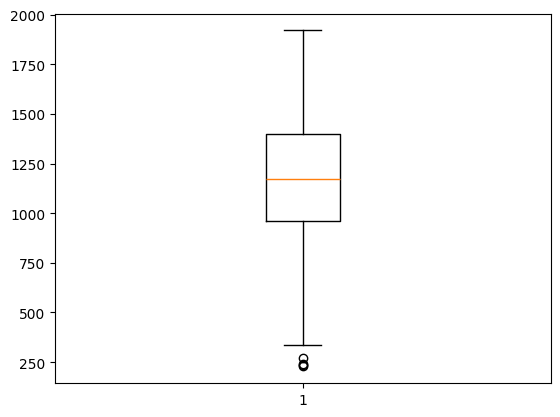
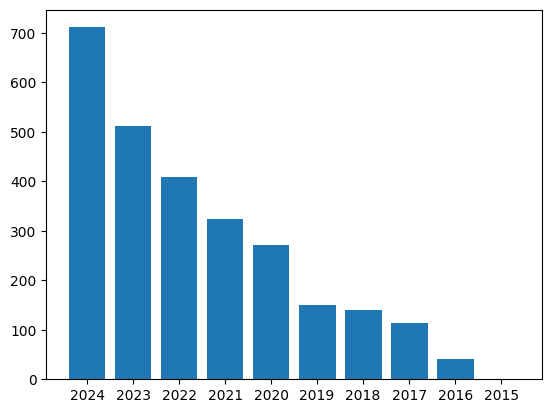

# research-retriever-agent
Uses hybrid search to retrieve relevant abstracts and a small LLM to generate responses based on the query.

## Pipeline

Query → FastAPI → Retrieve relevant papers → Route query ("creative" or "technical") → Generate response

## Installation:

1. Clone the repository:
```
git clone https://github.com/yourusername/research-retriever-agent.git
cd research-retriever-agent
```

2.	Create a virtual environment (optional but recommended):
```
python3 -m venv research-agent
source research-agent/bin/activate
```

3. Install dependencies:
`pip3 install -r requirements.txt`

## Usage

1. Start the FastAPI server:
`uvicorn demo:app --reload --port 8000`

2.	Send a POST request to /generate with JSON:
```
{
  "query": "Suggest open problems in computer vision."
}
```

The API response includes the generated answer, the determined subtask, and the retrieved documents for traceability.

## Components:

- `retriever.py`: Combines BM25 keyword search and semantic search with Reciprocal Rank Fusion
- `agent.py`: Small LLM (mistral-7b-instruct-v0.3) routes queries ("creative", "technical") and generates answers

### Model

Currently using **Mistral-7b-instruct** (via llama.cpp) hosted on FastAPI for faster startup.

**Considerations for model selection**
- Task type (research, summarization, reasoning)
- Computational resources (Apple Silicon, RAM constraints)
- Complexity and context length of queries

**Previous models used:**
- **Phi-3.5-mini-instruct**: Fast, issues with prompt echoing due to retrieval context
- **Qwen 7B**: Better prompt handling, slower startup on Apple Silicon

### BM25 Keyword Search

- Used to capture specific technical terms in abstracts.
- Accounts for varying abstract lengths and keyword saturation.
- Implementation: [`bm25s` library](https://github.com/xhluca/bm25s) for speed (memory trade-off).

### Semantic search

- Used to capture conceptual information (problem structure, general ideas) in abstracts.
- Embeddings generated with all-MiniLM-L6-v2
- FAISS used to create vector database for faster retrieval
- No chunking (relatively short documents, issues with idea splitting due to high information density)

### Reciprocal rank fusion

- Combines semantic and keyword search rankings
- K constant prevents top-ranking results in each list from dominating the overall ranking

## Data

src: [AI ArXiv Dataset](https://huggingface.co/datasets/jamescalam/ai-arxiv2)


Distribution of abstract lengths


Distribution of publication years

## Future changes

- Explore other models for better response quality
- Replace LLM router with heuristic method for speed
- Semantic chunking to handle dense abstracts
- Retrieve full papers rather than abstracts
- Expand retrieval to interdisciplinary databases

## License

This project is licensed under the MIT License - see the [LICENSE](LICENSE) file for details.